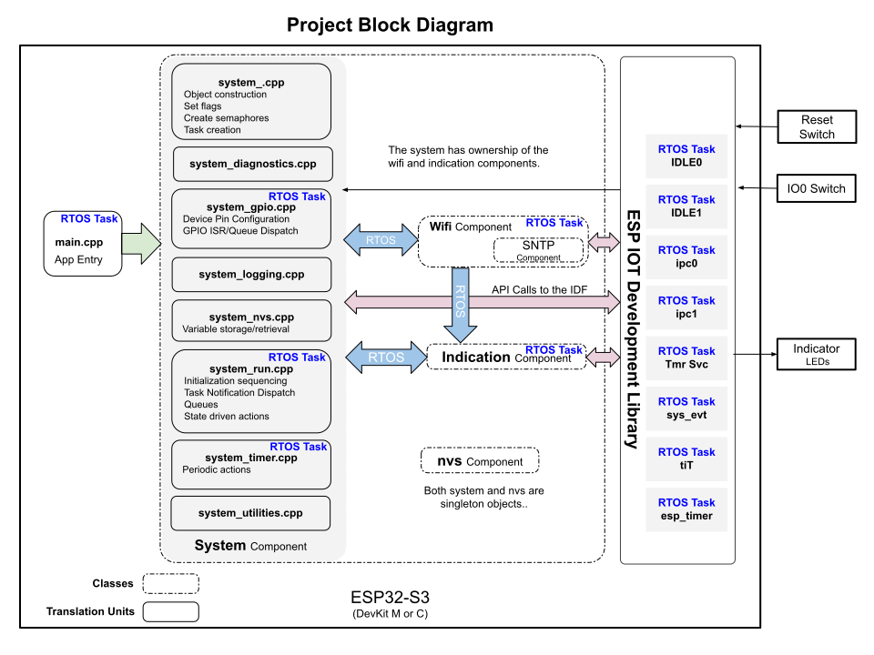

# README
---
This is a sample boiler plate project for a dual core Esp32 microcontroller running FreeRTOS.  This hardware is equivalent to a DevKit-M or C running an Esp32s3N16R8, but this project shoulb be portable to other duel and single core Esp32 processors without any changes.

If run on a single core processor, some of the features might not be necessary, but operation should still appear normal.

* Downloading, compiling, and running the application are all standard common processes and needs no special instruction.  This project only uses the ESP-IDF and is compiled on version 5.2.
* 
# Quick Start
---
1) Clone the project and open in VS Code.  
2) Run the ESP-IDF SDK Configure Editor (menuconfig)  

    >A. Select the correct GPIO pin under **WS2812 RGB LED**  
    >B. Apply the correct SSID and Password for your Wifi connection under **Wifi STA Manual Settings**  
    >C. Set your time zone under **Simple Network Time Protocol Settings**  
        (there is a link in the source code to help find your correct time zone on the web.)  

3) Set your COM port and flash method (UART) and you should be ready to go.  
4) Compile, Flash, and Monitor.  Apply input through GPIO0 push button switch.  

# Block Diagram
---
You're looking at an over-view of the classes, translation units and the FreeRTOS tasks (threads) for the entire project.  
  
The intent of this sample project is to prepare a suitable development code base for large scale advanced project development.  In pursuit of that goal, this project will evolve to include many other features which are not included here at this time.

Features which are included, explained, or demonstrated are:
1. C++ Construction
2. Component Construction
3. State Transition Program Flow.
4. Task Notification (freeRTOS)
5. Queues (which send commands and data)
6. Semaphore Locking (code entry and variables)
7. Basic Wifi Connectivity
8. Simple Network Time Protocol
9. WS2812 Addressable Indication RGB LED (employs the remote control transceiver (RMT) driver)

For more information about the system blocks at a project level, follow this link:

[project blocks](./docs/project_blocks.md)

## Abstractions  
On a project level, the primary abstraction is the operation of the entire system.  At present, the project doesn't interact much with the surrounding world, so it's abstraction value is limited.

[project abstraction](./docs/project_abstractions.md)

## Block Diagrams  
The primary block diagram of the project is shown above.  A block diagram shows the building blocks and sometimes a simplistic work process that starts on the left and moves to the right over time.

## Sequence Diagrams  
There are a few key sequences which are worth examining.  The one that is most interesting is how a object with a task is contructed and spun up.
[sequence diagrams](./docs/project_sequences.md)

## State Transition Program Flow
One of the basic premises of development in a cooperative multi-tasking system is that the processes (tasks) must yield back to the OS's scheduler on a regular basis frequently enough to supply enough processor time to service all tasks.   If any task doesn't yield, the system will starve of CPU time and the watchdog timer will expire causing a core panic followed by (in most cases) a reboot.

Therefore a strong development approach must include a smart and effient and easily understood way to complete descrete work and systematically yield to the OS (in this case freeRTOS).  There may be several approaches to solving this problem, but one well known approach is to use state transition modelling.

State transition modelling provides a well understood mechanism that upon input and time, a system moves from one state to another. In other words, with input, work is acheived, and the result is that the system completes a task, creates output, and reaches a possible stopping point.   It is at this stopping point, that we can yield back to the operating system.  When that task resumes work, it considers new input and has a next task to complete and does what is required before yielding again.  This cycle repeats continously to achieve the system's objectives incrementally.  Most of our programming will follow the state transition programming model.

On the down side, state modelling can't be seen in a single page of source code.  State modelling isn't a linear list of things to do (as is seen in most of Espressif's code examples).  State modelling resembles a series of inter-related repeating loops.  With time and experience, state modelling becomes easier to see and understand, but one way to more quickly some up to speed with it is to view state modelling diagrams and consider how it relates to source code.  As a rule, if you can easily diagram your intended state transition process, then it is likely to be expressable in code.   Additionally, explanating why you are doing something is typically very important so, always include good documentation about your design intent.

View this page for our state models at a project level.  
[state models](./docs/project_state_models.md)  
\<end of document>