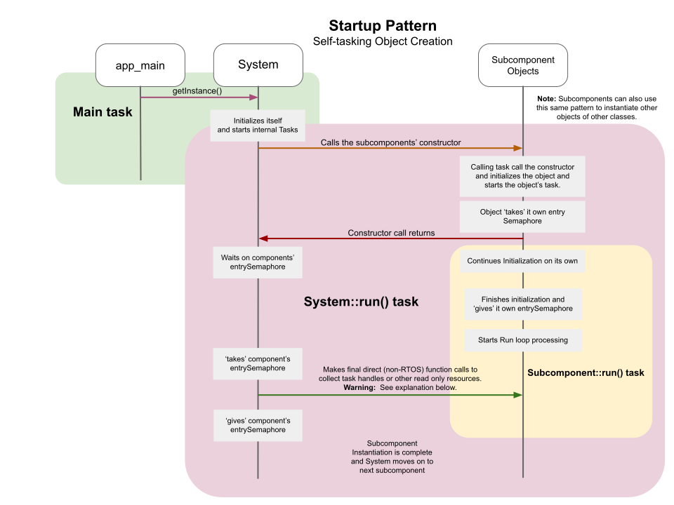

# Project Sequences
At a project level, this sequence explains the general startup process.  At the beginning, app_main() creates the System object and then the System object creates all other objects.  The System and all over main objects run their own tasks.  

The start up process is a pattern that can also be used in other cases where a parent object starts a child object (new object has its own task).

Below, there is also an example of a parent object starts a new object without a task.

## Object Startup Pattern - with New Task
The app_main() starts the System.  Each in turn, the System instantiates the remaining supporting components.

**The key thing to observe here is how the System starts another object.  This pattern will be used in all parts of the project where the new object has a run task**

The entry point calls sys->getInstance and this task (main task) runs inside the System contructor.

**Throughout the project, this pattern is applied to all independant objects.**  An independant object is one with its own running task.  A task-less object is depicted in the next section of this document.

* Step 1: app_main calls getInstance() of the System.  That constructer calls the member functions:
  * setFlags() - Static enabling of logging statements for any area of concern during development.
  * setLogLevels() - Manually sets log levels for tasks down the call stack for development.
  * createSemaphores() - Creates any locking semaphores owned by this object.
  * restoreVariablesFromNVS() - Brings back all persistant data for this new object.
  * Starts a run task (if the object is designed to have a task).

* Step 2: System calls on a class constructor.  The system's run task (thread) runs a set of member functions much like those of the system's constructor.  This pattern stays consistant for the sake of good programming practice.

* Step 3: The created object (typically of a subcomponent) 'takes' its own entry semaphore.  This locks that semaphore.  The purpose during initialization is that the calling object waits for that semaphore to become available so that it knows the initialization process at the created object is finished.

* Step 4: The created object runs an initialization loop of its own to fully initialize.

* Step 5: Created object finishes its initialization and releases the locking semaphore.

* Step 6: Created object begins to operating inside its own Run loop.

    **Warning is here**  
* Step 7: The System, now knowing that the create object is fully initialized, calls back to several task **unsafe** member functions to gather key RTOS handles.  These calls, though unsafe are typically not dangerous as the variables are written once at the created object and read once by the System object.  The chance for unsafe read/write collisions at start up are impossible at present because the created object never reads or writes those particular variable RTOS handles again after they are initialized.

* Step 8: The System releases the object locking semaphore.  It is important to note that most object locking semaphores are never used again after intialization of the object because after this point, we will use Task Notifications or Queues to gain task safe access.  Without these RTOS entry mechanisms, the only way to abritrate entrance to an object is with a locking semaphore (or mutex, or some other construct).   In this project the singleton nvs object uses only an object level locking semaphore.  All other objects expose Task Notifictions or Queues.

## Object Startup Pattern - without Task

* Step 1: Calling object is already initialized and running its own task.

* Step 2: Calling object calls the created object's constructer.  These member functions are called:
  * setFlags() - Static enabling of logging statements for any area of concern during development.
  * setLogLevels() - Manually sets log levels for tasks down the call stack for development.
  * createSemaphores() - Creates any locking semaphores owned by this object.
  * restoreVariablesFromNVS() - Brings back all our persistant data for the created object.

There are no other project level sequences that would be of global interest.