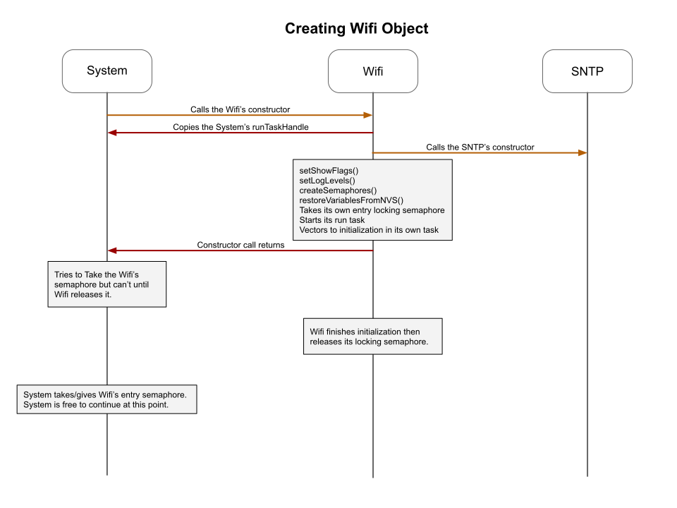
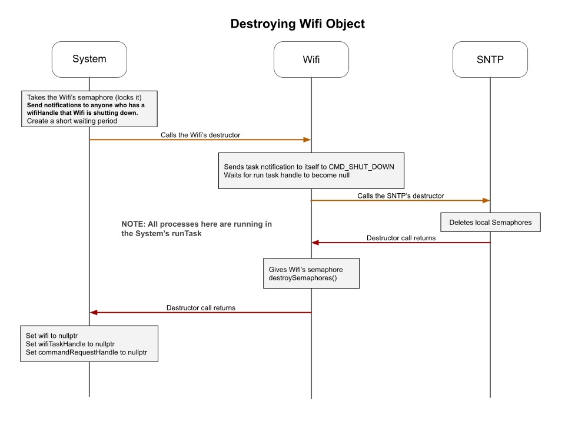

# System Sequences
The creatation of the system object and the generalized process of creating subcomponents (with Tasks and without Tasks) is detailed at the project level [here](../../docs/project_sequences.md)

Sequencing is typically represented as a series of actions between two parties over time.  In the case of software, these parties are either objects or translations units or binary executable components.

In our specific case, we use sequences to represent actions between two or more objects.

## Creating Wifi Object
This is a very common pattern where an object with a run task is creating another object with its own run task.  In this case, inside the constructor, the Wifi also creates the non-tasking SNTP object.  

Typically we would prefer to have the same task (thread) to both lock and unlock semaphores.  This is one of the cases where the interaction between tasks does not allow me to use the same task to unlock the wifi's entry locking semaphore.  The System task locked the semaphore in the Wifi's constructor, and the Wifi task unlocks it after all intialization is complete.
  

## Destroying Wifi Object
 

## Wifi Connection

## Wifi Disconnection

