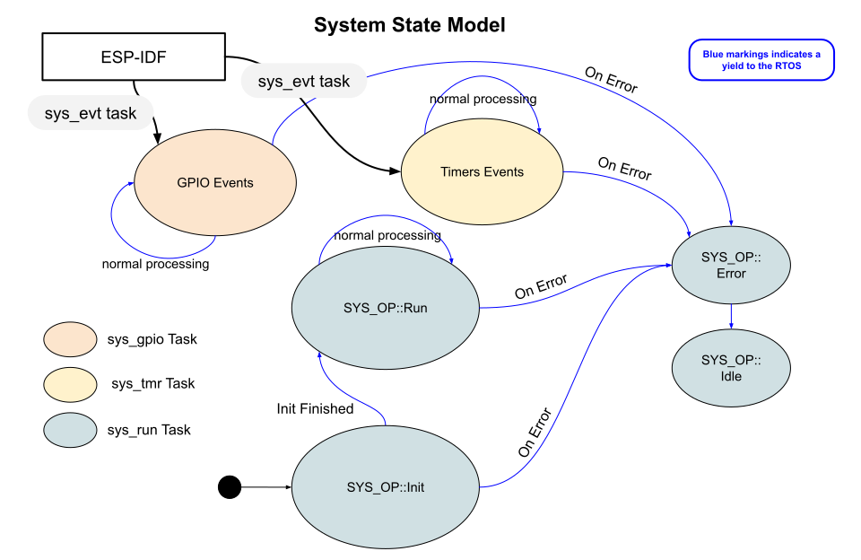

# System State Models
Most of the state transition models for the System are related to System Operations.  These operations take place in the run() function located in system_run.cpp.  You can reference descriptions of System Operations [here](./system_operations.md)

**This is our top levle model for the System (main) component:**

The system state as a whole is not always so clearly defined due to the fact that 3 threads run at the system level.  You might consider that these are 3 related sub-systems which cooperate when required through RTOS messaging techniques.  After initialization, the system is always in the Run state and handling either Task Notifications, Commands from a Queue, or responding to variable changes.

The GPIO task is always available to handle gpio generated interrupts.  All communication between the GPIO task and the Run task must use thread safe RTOS techniques.

The Timer task is currently always running and creating timer events which invoke RTOS mechanisms to send task notifications or change local System variables.

## System Operation Initializaton
We can include operational states in our diagrams.  Here, we model everything which is inside SYS_OP::Init above.